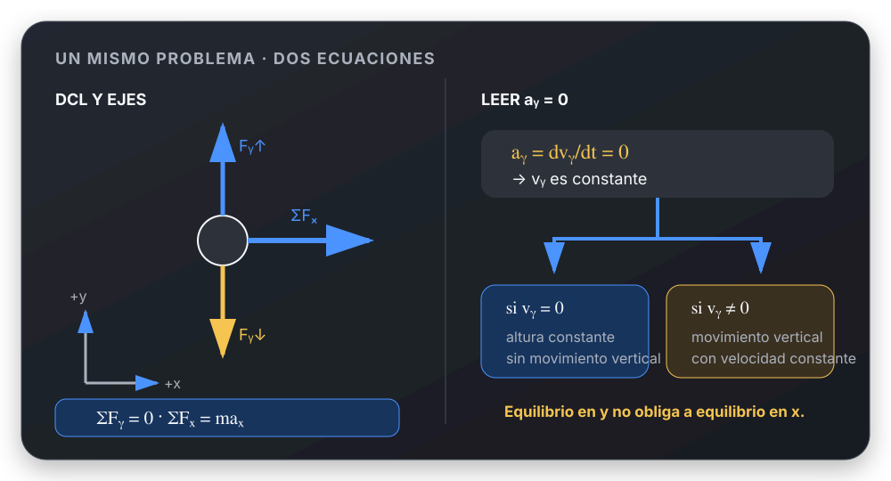

# Equilibrio por componentes

## 🎯 Qué recordar

Puede haber equilibrio en un eje y aceleración en otro.

$a_y=0$ significa que la componente vertical de la velocidad **no cambia**:
$v_y$ es constante. No obliga por sí sola a que $v_y=0$.

Si además $v_y$ parte de cero, entonces permanece en cero y no cambia la
altura.

## 🖼️ Esquema / dibujo

## 📐 Fórmula

Un problema puede cumplir simultáneamente:

$$
\sum F_y=ma_y=0
$$

$$
\sum F_x=ma_x\neq0
$$

Como $a_y=dv_y/dt=0$:

$$
v_y=\text{constante}
$$

## ⚠️ Error frecuente

❌ “$a_y=0$, entonces no existe movimiento vertical”.

✔ “$a_y=0$, entonces $v_y$ no cambia”. Sólo puede afirmarse que no hay
movimiento vertical si además se sabe que $v_y=0$.

## 🔗 Ver también

- [Segunda Ley de Newton](segunda-ley-newton.md)
- [Dividir ecuaciones](../metodos/dividir-ecuaciones.md)
- [Descomponer una fuerza inclinada](../herramientas-matematicas/descomponer-fuerza-inclinada.md)
