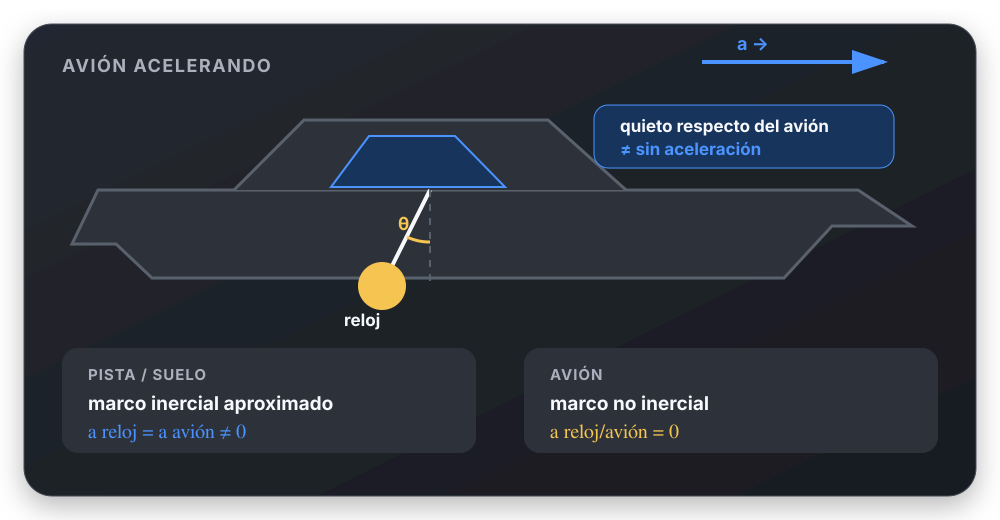

# Marcos inerciales y no inerciales

## 🎯 Qué recordar

Antes de aplicar la Segunda Ley, escribir **desde qué marco se observa**.

- Un marco que acelera respecto de uno inercial es **no inercial**.
- Durante el despegue, el avión es un marco no inercial; la pista puede tomarse
  como marco inercial aproximado.
- Que el reloj esté quieto respecto del avión no implica que su aceleración sea
  cero respecto de la pista.

## 🖼️ Esquema / dibujo

## 📐 Fórmula

Si el reloj conserva su posición dentro del avión:

$$
\vec a_{\text{reloj/avión}}=\vec 0,
\qquad
\vec a_{\text{reloj/pista}}=\vec a_{\text{avión/pista}}\neq\vec 0
$$

Desde la pista, usando únicamente fuerzas reales:

$$
\sum\vec F_{\text{reales}}=m\vec a_{\text{reloj/pista}}
$$

Desde el avión debe agregarse explícitamente la fuerza inercial:

$$
\sum\vec F_{\text{reales}}+\vec F_{\text{inercial}}
=m\vec a_{\text{reloj/avión}},
\qquad
\vec F_{\text{inercial}}=-m\vec a_{\text{avión/pista}}
$$

La fuerza inercial no representa una interacción real: aparece por elegir el
marco acelerado.

## ⚠️ Error frecuente

❌ “Está quieto dentro del avión, entonces $\vec a=\vec 0$”.

✔ Primero indicar el marco. El reloj puede tener aceleración nula respecto del
avión y, al mismo tiempo, acelerar respecto de la pista.

❌ Empezar las ecuaciones en un marco y terminarlas en otro.

## 🔗 Ver también

- [Segunda Ley de Newton](segunda-ley-newton.md)
- [Equilibrio por componentes](equilibrio-por-componentes.md)
- [Dividir ecuaciones](../metodos/dividir-ecuaciones.md)
