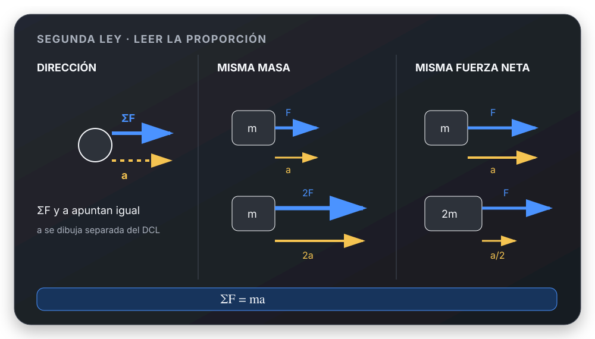

# Segunda Ley de Newton

## 🎯 Qué recordar

La aceleración tiene la dirección y el sentido de la **fuerza neta**. No sigue
necesariamente a una fuerza individual.

- Con $m$ constante: mayor $|\sum\vec F|$ → mayor $|\vec a|$.
- Con la misma fuerza neta: mayor $m$ → menor $|\vec a|$.
- Se aplica por componentes según los ejes elegidos.

## 🖼️ Esquema / dibujo

## 📐 Fórmula

$$
\sum\vec F=m\vec a
$$

En ejes cartesianos:

$$
\sum F_x=ma_x,
\qquad
\sum F_y=ma_y
$$

En una trayectoria curva pueden convenir direcciones locales:

$$
\sum F_r=ma_r,
\qquad
\sum F_t=ma_t
$$

## ⚠️ Error frecuente

- Dibujar $m\vec a$ como si fuera otra fuerza en el DCL.
- Usar una sola fuerza en la ecuación cuando hay que sumar todas sus
  componentes sobre el eje.
- Mezclar componentes cartesianas $(x,y)$ con radial/tangencial sin definirlas.

## 🔗 Ver también

- [Equilibrio por componentes](equilibrio-por-componentes.md)
- [Marcos inerciales y no inerciales](marcos-inerciales-y-no-inerciales.md)
- [Elegir ejes y asignar signos](../metodos/elegir-ejes-y-signos.md)
- [Verificar un resultado](../metodos/verificar-resultado.md)
- [Movimiento Circular - machete visual](../../movimiento-circular/Movimiento_Circular_UTN_FRLP.md)
