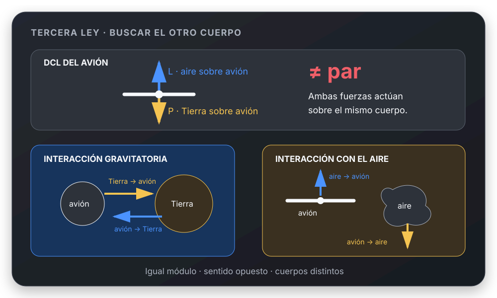

# Tercera Ley de Newton

## 🎯 Qué recordar

Un par acción-reacción siempre corresponde a una misma interacción y actúa
sobre **dos cuerpos distintos**.

Por eso, dos fuerzas dibujadas sobre el mismo DCL no forman entre sí un par de
acción-reacción.

## 🖼️ Esquema / dibujo

## 📐 Fórmula

Para la interacción entre los cuerpos $A$ y $B$:

$$
\vec F_{A\to B}=-\vec F_{B\to A}
$$

En el caso conceptual del avión:

- el peso es la fuerza gravitatoria de la Tierra sobre el avión; su reacción
  es la fuerza gravitatoria del avión sobre la Tierra;
- la sustentación es la fuerza del aire sobre el avión; su reacción es la
  fuerza del avión sobre el aire.

## ⚠️ Error frecuente

❌ Decir que peso y sustentación son acción-reacción porque tienen sentidos
opuestos.

Ambas actúan sobre el avión y pertenecen al mismo DCL. Pueden equilibrarse,
pero no constituyen un par de Tercera Ley.

## 🔗 Ver también

- [Segunda Ley de Newton](segunda-ley-newton.md)
- [Elegir ejes y asignar signos](../metodos/elegir-ejes-y-signos.md)
- [Descomponer una fuerza inclinada](../herramientas-matematicas/descomponer-fuerza-inclinada.md)
