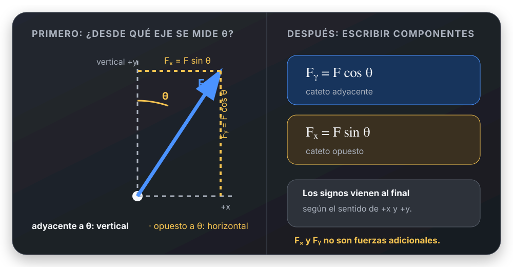

# Descomponer una fuerza inclinada

## 🎯 Qué recordar

Antes de elegir seno o coseno, marcar **respecto de qué eje** está medido el
ángulo.

- Cateto adyacente al ángulo → coseno.
- Cateto opuesto al ángulo → seno.

No memorizar “$x$ lleva coseno” o “$y$ lleva seno”.

## 🖼️ Esquema / dibujo

## 📐 Fórmula

Si $\theta$ está medido desde la **vertical**:

$$
F_y=F\cos\theta,
\qquad
F_x=F\sin\theta
$$

Si el ángulo estuviera medido desde la horizontal, se intercambiarían los
papeles de seno y coseno. Los signos se asignan después, según el sentido de
cada eje.

## ⚠️ Error frecuente

- Elegir seno/coseno antes de dibujar el triángulo.
- Confundir el módulo positivo de una componente con su signo algebraico.
- Dibujar $F_x$ y $F_y$ como fuerzas nuevas además de $\vec F$: son
  componentes de la misma fuerza.

## 🔗 Ver también

- [Trigonometría](../referencias-rapidas/trigonometria.md)
- [Elegir ejes y asignar signos](../metodos/elegir-ejes-y-signos.md)
- [Dividir ecuaciones](../metodos/dividir-ecuaciones.md)
- [Movimiento Circular - machete visual](../../movimiento-circular/Movimiento_Circular_UTN_FRLP.md)
