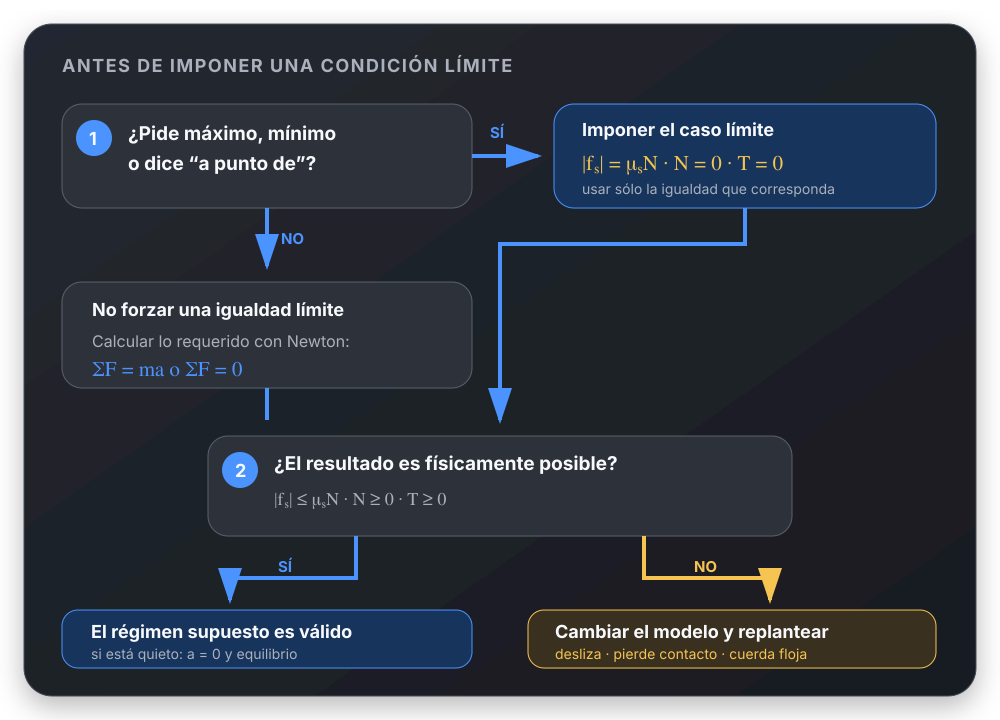

# Antes de plantear Newton

## 🎯 Qué recordar

Primero decidir si el sistema se mueve. Si permanece en equilibrio,
\(a=0\) y no hacen falta ecuaciones con aceleración.

## 🖼️ Esquema / dibujo



## 📐 Fórmula

En equilibrio:

$$
\sum \vec F=0
$$

Ejemplo mínimo para dos bloques unidos por una cuerda:

```text
Bloque A        Bloque B
T = fₑ          Pᴮ = T
```

El rozamiento se obtiene del equilibrio. No se reemplaza directamente por
\(\mu_eN\).

## ⚠️ Error frecuente

❌ Suponer movimiento y plantear aceleraciones sin revisar el caso límite.

✔ Comparar primero la situación real con el límite. Si no lo supera, usar
\(a=0\) y equilibrio.

## 🔗 Ver también

- [Rozamiento estático](../referencias-rapidas/rozamiento-estatico.md)
