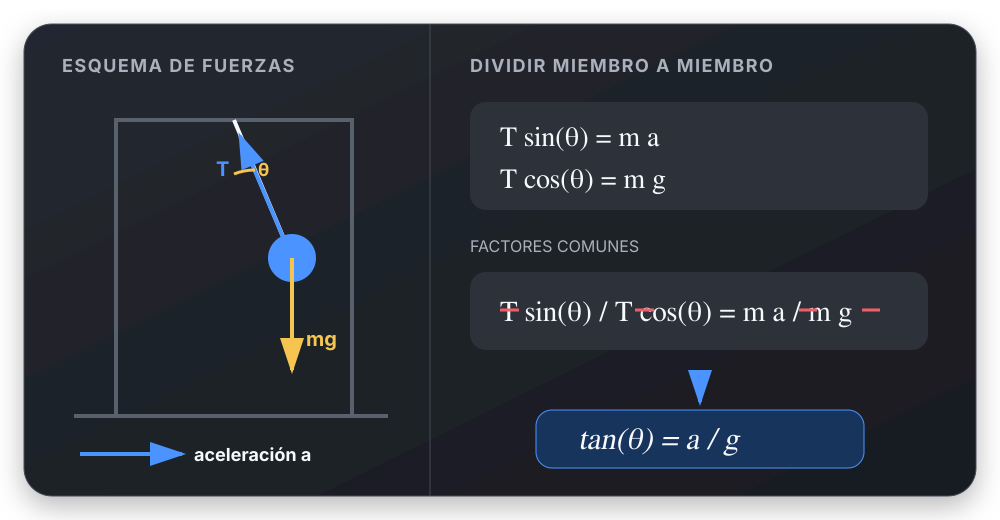

# Dividir ecuaciones para eliminar una incógnita común

## 🎯 Qué recordar

Si dos ecuaciones válidas contienen la misma incógnita como factor, dividir una
por la otra puede eliminarla sin despejarla.

Conviene probarlo cuando:

- las ecuaciones describen dos direcciones del mismo problema;
- el factor común es distinto de cero;
- el cociente deja una relación más simple.

## 🖼️ Esquema / dibujo

## 📐 Fórmula

Para una masa suspendida dentro de un automóvil acelerado:

Tomando un marco de referencia inercial y suponiendo que la masa mantiene un
ángulo constante respecto del automóvil, su aceleración horizontal es la del
automóvil y su aceleración vertical es cero. En el DCL aparecen solamente las
fuerzas reales: tensión y peso.

$$
T\sin\theta=ma
$$

$$
T\cos\theta=mg
$$

Dividiendo miembro a miembro la primera ecuación por la segunda:

$$
\frac{T\sin\theta}{T\cos\theta}
=
\frac{ma}{mg}
\quad\Longrightarrow\quad
\tan\theta=\frac{a}{g}
$$

Los factores \(T\) y \(m\) se simplifican porque son comunes y no nulos.

La propiedad usada es:

$$
A=B,\quad C=D,\quad C\neq0,\quad D\neq0
\quad\Longrightarrow\quad
\frac{A}{C}=\frac{B}{D}
$$

> En un examen: “Dividiendo miembro a miembro la ecuación (1) por la
> ecuación (2)”.

## ⚠️ Error frecuente

No mezclar marcos de referencia: en el marco inercial no se agrega una fuerza
por la aceleración del automóvil. Si se analiza desde el automóvil, que es un
marco no inercial, el planteo requiere explicitar la fuerza inercial.

Solo se simplifican **factores** comunes:

$$
\frac{T\sin\theta}{T\cos\theta}
=
\frac{\sin\theta}{\cos\theta}
$$

No se cancelan términos que están sumando:

$$
\frac{T+\sin\theta}{T+\cos\theta}
\neq
\frac{\sin\theta}{\cos\theta}
$$

Antes de simplificar, comprobar que la cantidad sea un factor y que no sea cero.

## 🔗 Ver también

- [Referencia rápida de trigonometría](../referencias-rapidas/trigonometria.md)
