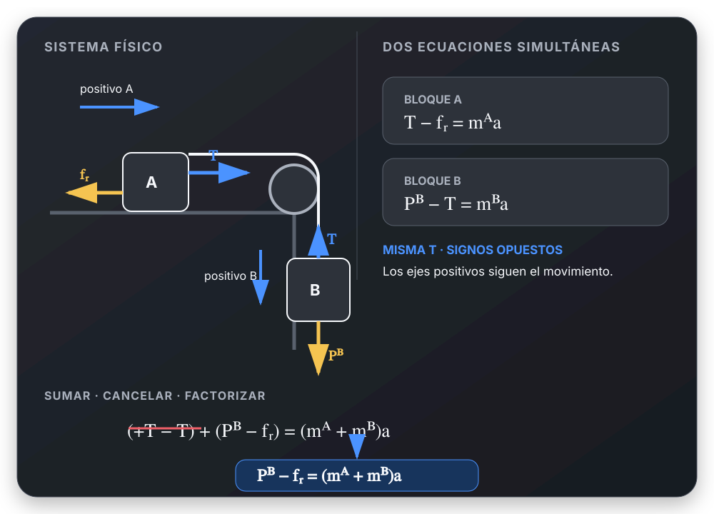
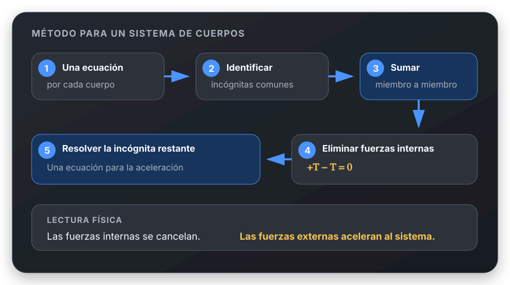

# Eliminación de la tensión en sistemas de partículas

## 🎯 Qué recordar

Dos cuerpos unidos por una cuerda ideal comparten dos incógnitas: la tensión
\(T\) y la aceleración \(a\). Sus ecuaciones son verdaderas al mismo tiempo:
forman un **sistema de ecuaciones**.

Sumarlas miembro a miembro permite cancelar \(T\). No es «sumar polinomios»:
es un método para resolver el sistema.

## 🖼️ Esquema / dibujo



### ¿Qué operaciones se usan?

Sumar las ecuaciones → cancelar \(+T-T\) → factorizar
\(m_Aa+m_Ba=(m_A+m_B)a\).

### ¿Por qué desaparece la tensión?

```text
Dos cuerpos
     ↓
Dos ecuaciones
     ↓
Una incógnita común: T
     ↓
Sumo las ecuaciones
     ↓
+T − T = 0
     ↓
Quedan las fuerzas externas
     ↓
Obtengo la aceleración
```

## 📐 Fórmula

Ejemplo para dos bloques, con la misma dirección positiva del movimiento:

$$
\text{Bloque A:}\qquad T-f_r=m_Aa
$$

$$
\text{Bloque B:}\qquad P_B-T=m_Ba
$$

Sumando miembro a miembro:

$$
(T-f_r)+(P_B-T)=m_Aa+m_Ba
$$

Agrupando y factorizando:

$$
T-T+P_B-f_r=(m_A+m_B)a
$$

$$
\boxed{P_B-f_r=(m_A+m_B)a}
$$

La cancelación algebraica muestra algo físico: al tomar los bloques y la
cuerda ideal como un solo sistema, las tensiones son fuerzas internas de igual
módulo y sentido opuesto. Su resultante es cero; permanecen las fuerzas
externas.

### Método general



## ⚠️ Error frecuente

❌ Pensar que se están sumando polinomios o que \(T\) desaparece por un truco
algebraico.

✔ Se está resolviendo un sistema de ecuaciones. \(T\) se cancela porque aparece
con signos opuestos y, para el sistema completo, representa una interacción
interna.

La cancelación supone una cuerda ideal. Si la cuerda o la polea no son ideales,
las tensiones podrían no tener el mismo módulo.

## 🔗 Ver también

- [Dividir ecuaciones para eliminar una incógnita común](dividir-ecuaciones.md)
- [Elegir ejes y asignar signos](elegir-ejes-y-signos.md)
