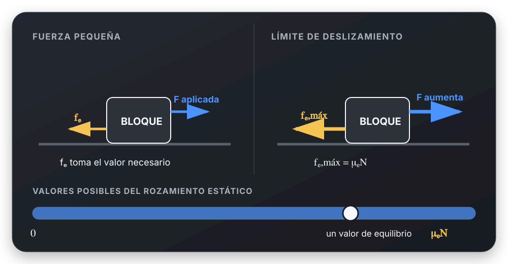

# Rozamiento estático

## 🎯 Qué recordar

El rozamiento estático **no siempre vale** \(\mu_e N\). Se adapta a lo
necesario para mantener el equilibrio:

$$
0 \leq f_e \leq \mu_e N
$$

Solo en el límite de comenzar a deslizar:

$$
f_e=f_{e,\text{máx}}=\mu_e N
$$

## 🖼️ Esquema / dibujo

Fuerza pequeña → \(f_e\) se adapta. Fuerza al límite →
\(f_e=f_{e,\text{máx}}=\mu_eN\).

## 📐 Fórmula

Usar \(f_e=\mu_eN\) si dice:

- «está a punto de deslizar»;
- «masa máxima»;
- «rozamiento máximo»;
- «umbral de movimiento».

No usarla solo porque el cuerpo está en reposo. En ese caso, obtener \(f_e\)
con la Segunda Ley de Newton y verificar que \(f_e\leq\mu_eN\).

### Checklist

Antes de escribir \(f_e=\mu_eN\), preguntarme:

- [ ] ¿Está en el límite?
- [ ] ¿Dice «masa máxima»?
- [ ] ¿Dice «a punto de deslizar»?
- [ ] ¿Pide rozamiento máximo?

Si todas son **no** → usar equilibrio.

## ⚠️ Error frecuente

❌ Como el cuerpo está quieto:

$$
f_e=\mu_eN
$$

✔ Si está quieto, primero aplicar equilibrio. Luego verificar
\(f_e\leq\mu_eN\). La igualdad corresponde solo al límite de deslizamiento.

## 🔗 Ver también

- [Antes de plantear Newton](../metodos/antes-de-plantear-newton.md)
