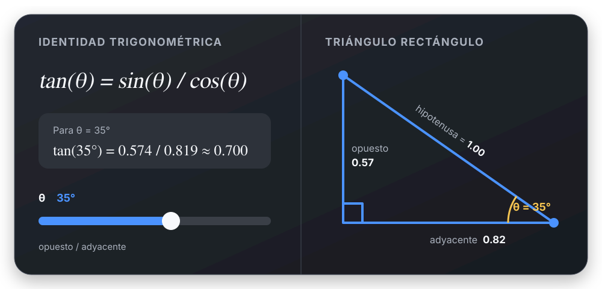

# Trigonometría

## 🎯 Qué recordar

En un triángulo rectángulo, elegí primero el ángulo de referencia. Los nombres
“opuesto” y “adyacente” dependen de ese ángulo; la hipotenusa no cambia.

## 🖼️ Esquema / dibujo

## 📐 Fórmula

| Relación | Fórmula | Uso rápido |
| --- | --- | --- |
| Seno | \(\sin\theta=O/H\) | Relacionar opuesto e hipotenusa |
| Coseno | \(\cos\theta=A/H\) | Relacionar adyacente e hipotenusa |
| Tangente | \(\tan\theta=O/A=\sin\theta/\cos\theta\) | Relacionar los catetos |
| Arcoseno | \(\theta=\arcsin(O/H)\) | Hallar el ángulo con \(O\) y \(H\) |
| Arcocoseno | \(\theta=\arccos(A/H)\) | Hallar el ángulo con \(A\) y \(H\) |
| Arcotangente | \(\theta=\arctan(O/A)\) | Hallar el ángulo con ambos catetos |

## ⚠️ Error frecuente

- Intercambiar el cateto opuesto y el adyacente.
- Invertir el cociente de la tangente.
- Usar arcoseno o arcocoseno con un cociente fuera de \([-1,1]\).
- Mezclar grados y radianes en la calculadora.

## 🔗 Ver también

- [Dividir ecuaciones para eliminar una incógnita común](../metodos/dividir-ecuaciones.md)
