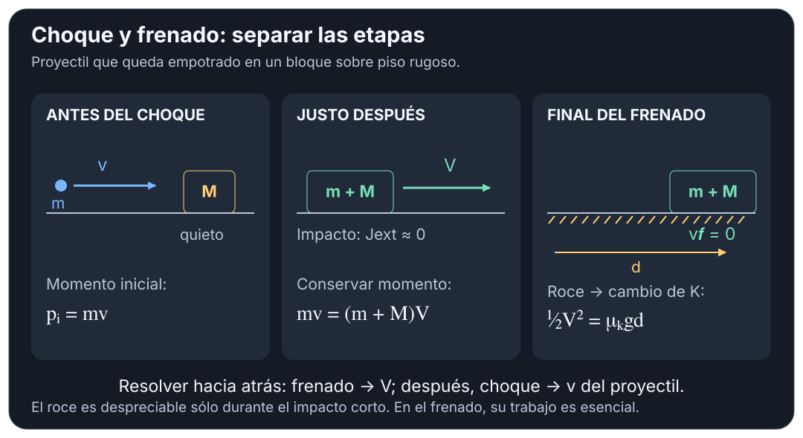
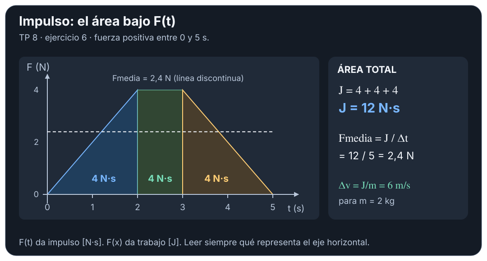

# Impulso y cantidad de movimiento — resolución por casos

## 🎯 Qué recordar

**Antes de calcular:** elegir sistema → marcar justo antes y justo después →
fijar ejes → evaluar impulso externo → escribir el balance por componentes.
Si faltan ecuaciones, buscar el tipo de choque, una velocidad relativa o
la energía de una etapa posterior. Referencias: **TP 8**.

## 🖼️ Esquema / dibujo

La velocidad de salida de una etapa es la de entrada de la siguiente. Si hay
caída o recorrido previo al impacto, resolver primero esa etapa por energía
o cinemática.

## 📐 Fórmula

### 1. Frenada, golpe o gráfico $F(t)$ — ej. 1–4, 6–7, 20

Para masa constante: $J_{net}=m(v_f-v_i)$ y $F_{net,med}=J_{net}/\Delta t$.
Si dan un gráfico, sumar áreas con signo. Si piden **una fuerza de contacto**,
descontar los demás impulsos: $\vec J_{contacto}=\Delta\vec p-\vec J_{otras}$.
Si dan distancia de penetración, primero energía o cinemática; el gráfico
$F(x)$ da trabajo, no impulso.

### 2. Rebote contra pared / piso — ej. 3, 5

Fijar ejes normal y tangente. En un rebote ideal contra pared lisa se invierte
la velocidad normal y se conserva la tangencial (despreciando otros impulsos).
Entonces $|J_n|=2m|v_n|$. Si el ángulo es con la **pared**, $|v_n|=v\sin\theta$;
si es con la normal, $v\cos\theta$.
En un piso, arriba positivo: $N_{med}=m(v_f-v_i)/\Delta t+mg$.

### 3. Centro de masa y su energía — ej. 8–10, 12, 14

Hacer una tabla $m_j,x_j,y_j,v_{jx},v_{jy}$ y calcular los promedios ponderados.
Después $\vec v'_j=\vec v_j-\vec v_{CM}$.
Comprobar $\sum m_j\vec v'_j=0$ y
$K=\frac12Mv_{CM}^2+\sum\frac12m_jv_j'^2$.
El CM queda más cerca de la masa mayor; $P=0$ no exige que cada cuerpo esté quieto.

### 4. Persona sobre tablón / velocidades relativas — ej. 11, 13, 35

Para persona + tablón sin fuerza externa horizontal y inicialmente quietos:
$m_pv_p+m_tv_t=0$, con velocidades **respecto del suelo**.
Agregar $v_p-v_t=v_{p/t}$ si dan la velocidad relativa. Si interesa desplazamiento,
el CM permanece fijo y $m_p\Delta x_p+m_t\Delta x_t=0$.
En el ej. 11, el rebote en la pared es una etapa con impulso externo al sistema
persona + bola: no conservar su momento de principio a fin.

### 5. Quedan unidos — ej. 15–16, 20, 22–23

$$
v_f=\frac{m_1v_{1i}+m_2v_{2i}}{m_1+m_2}.
$$

Calcular luego $K_i$ y $K_f$ por separado. Si piden **pérdida**, informar
$K_i-K_f\geq0$; si piden **variación**, $\Delta K=K_f-K_i\leq0$.
La conservación de $K$ no es una ecuación disponible en esta etapa.

### 6. Choque frontal elástico / dato de restitución — ej. 15–19, 21, 26

Resolver dos ecuaciones: momento y
$v_{2f}-v_{1f}=e(v_{1i}-v_{2i})$. Para elástico usar $e=1$.
Si $m_2$ parte del reposo, el atajo elástico es:
$v_{1f}=(m_1-m_2)v_{1i}/(m_1+m_2)$,
$v_{2f}=2m_1v_{1i}/(m_1+m_2)$.
Con masas iguales intercambian velocidades. Si no informan el tipo pero dan
una velocidad final, usar momento para la otra y evaluar después $\Delta K$.

### 7. Choque + roce / altura / resorte — ej. 22–25

1. **Antes:** hallar la velocidad de entrada por energía, si hace falta.
2. **Impacto:** conservar momento en el eje con impulso externo despreciable;
   agregar la condición de choque. Si el proyectil atraviesa el bloque,
   incluir **su momento de salida**.
3. **Después:** aplicar energía con las masas y velocidades resultantes.

Bloque + proyectil unidos que frenan en piso: $V=\sqrt{2\mu_kgd}$;
entonces $m_bv_b=(m_b+m_B)V$ si el bloque estaba quieto.
Si suben sin roce: $V^2=2gh$; si comprimen un resorte horizontal ideal:
$\frac12MV^2=\frac12kx^2$.

**Platillo vertical del ej. 23:** cambia el equilibrio tras pegarse el barro.
Con $\delta$ como deformación estática **anterior** y $y$ como bajada adicional:
$\frac12MV^2+Mgy=\frac12k[(\delta+y)^2-\delta^2]$.
Usar $M$ combinado, $V$ posterior al choque y la raíz positiva; no perder el
estiramiento que ya tenía el resorte.

### 8. Choque oblicuo — ej. 27–29, 31–32

Escribir $\sum m_jv_{jx,i}=\sum m_jv_{jx,f}$ y lo mismo en $y$.
Proyectar ángulos desde el eje indicado; el signo lo da el cuadrante.
Usar $K_i=K_f$ **sólo** si es elástico. Para el vector desconocido:
$v=\sqrt{v_x^2+v_y^2}$ y determinar el ángulo respetando el cuadrante.
Si falta una masa, conservarla simbólica: no suponer masas iguales sin indicación.

### 9. Retroceso, separación o explosión — ej. 30, 33–36

En el intervalo corto: $\vec P_{antes}=\sum m_j\vec v_{j,después}$ si el
impulso externo es despreciable. Si parte del reposo en 1D:
$v_2=-m_1v_1/m_2$. Revisar si la velocidad dada es respecto del suelo o del
otro cuerpo. En una explosión en vuelo, después del estallido cada fragmento
hace su propio tiro; la energía cinética puede aumentar.

### Dos comprobaciones cortas

**TP 8, ej. 6 — área fuerza–tiempo.** La figura tiene un triángulo de 0 a 2 s,
un rectángulo de 2 a 3 s y otro triángulo de 3 a 5 s, con máximo de 4 N:

$$
J=\tfrac12(2)(4)+(1)(4)+\tfrac12(2)(4)=12\ \mathrm{N\,s}.
$$

Para $m=2$ kg y $v_i=-2$ m/s: $v_f=v_i+J/m=4$ m/s.
$F_{med}=12/5=2{,}4$ N. **Comprobación:** $\Delta p=2[4-(-2)]=12$ N·s.

**TP 8, ej. 22 — bala empotrada y frenado.** $m_b=0{,}005$ kg,
$m_B=1$ kg, $\mu_k=0{,}20$, $d=0{,}25$ m; bloque inicialmente quieto.
Eje positivo en el sentido de la bala. Despreciar el impulso del roce sólo
durante el choque corto; conservarlo como trabajo durante el frenado:

$$
V=\sqrt{2(0{,}20)(9{,}8)(0{,}25)}=0{,}990\ \mathrm{m/s},\qquad
v_b=\frac{1{,}005}{0{,}005}V\simeq199\ \mathrm{m/s}.
$$

**Comprobación:** $K$ justo después ($0{,}49245$ J) coincide con
$\mu_k(m_b+m_B)gd$. **Idea:** resolver hacia atrás, frenado primero y choque después.

## ⚠️ Error frecuente

- Antes de conservar momento, escribir **de qué sistema y durante qué intervalo**.
- Un bloque sujeto al suelo recibe impulso externo: no tratarlo como un bloque libre.
- Un rebote cambia el signo de una componente: $v_f-v_i$ no es restar rapideces.
- Una única ecuación de momento en 1D no alcanza para dos velocidades finales
  desconocidas: hace falta otra condición física.

## 🔗 Ver también

- [Teoría esencial](teoria-esencial.md)
- [Trabajo y Energía: resolución](../trabajo-energia/resolucion-por-casos.md)
- [MAS: nuevo equilibrio](../movimiento-armonico-simple/resolucion-por-casos.md)
- [Fuentes](fuentes.md) · [Volver al tema](README.md)
