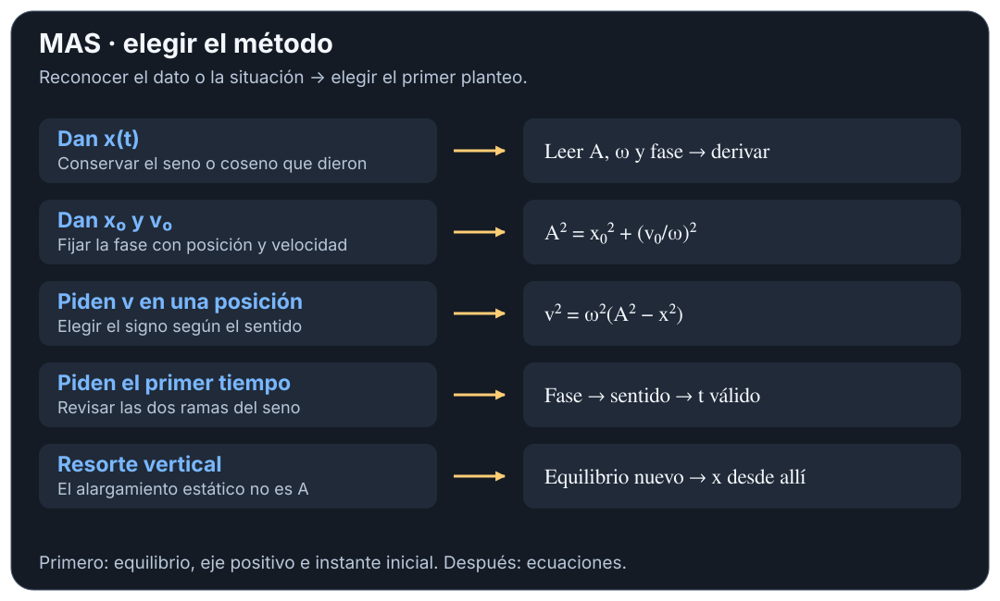
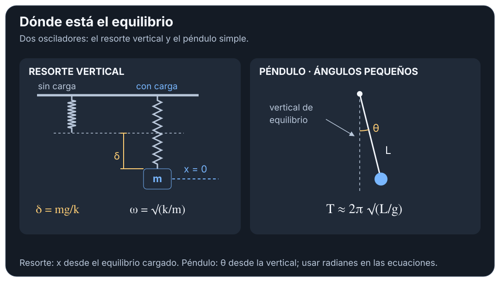

# MAS — resolución por casos

## 🎯 Qué recordar

Primero fijar **equilibrio, eje positivo e instante inicial**. Pasar a SI,
hallar $\omega$ y decidir si hace falta el tiempo. Sin tiempo, usar
$v^2=\omega^2(A^2-x^2)$; con tiempo, usar la función horaria.
Las referencias corresponden al **TP 7**.

## 🖼️ Esquema / dibujo

## 📐 Fórmula

### 1. Dan la ecuación horaria — ej. 1–2, 7, 26

Leer el coeficiente de **$t$ dentro del argumento**: ese es $\omega$.
Derivar sin cambiar seno por coseno arbitrariamente; cada derivada aporta
otro $\omega$. Calcular $T=2\pi/\omega$ y sustituir $t=0$ para comprobar la fase.
Si dan rpm: $f=\mathrm{rpm}/60$; para un pistón, $A=\text{carrera}/2$.

### 2. Armar $x(t)$ con datos iniciales — ej. 5, 9, 11

Con $A=\sqrt{x_0^2+(v_0/\omega)^2}$, imponer simultáneamente
$\sin\varphi_0=x_0/A$ y $\cos\varphi_0=v_0/(A\omega)$.
Soltado desde $+A$: $\varphi_0=\pi/2$; desde el centro hacia $+x$:
$\varphi_0=0$; desde el centro hacia $-x$: $\varphi_0=\pi$.

### 3. Tiempo hasta una posición — ej. 9, 12–13

Resolver $\sin\psi=x/A$: $\psi=\arcsin(x/A)+2\pi n$ **o**
$\psi=\pi-\arcsin(x/A)+2\pi n$. Elegir según el signo de
$v=A\omega\cos\psi$, calcular $t=(\psi-\varphi_0)/\omega$ y tomar el primer
instante del intervalo pedido. No suponer que el movimiento tiene rapidez constante.

### 4. Calibrar resortes / varios resortes — ej. 3–4, 10, 15

En equilibrio vertical: $k\delta=mg$. Por escala de una balanza: $k=F/\delta$.
Con $n$ oscilaciones en un intervalo: $T=\Delta t/n$.
Resortes que soportan la misma oscilación en paralelo: $k_{eq}=\sum k_j$;
usar la masa total que oscila. Luego $\omega=\sqrt{k_{eq}/m}$.

### 5. Resorte vertical / se detiene el ascensor — ej. 11, 15

Calcular el equilibrio y medir $x$ respecto de él. Si el soporte se detiene
bruscamente y el impulso sobre la masa es despreciable, la masa conserva
su velocidad instantánea: ese es $v_0$ para la oscilación posterior.
En el ej. 11, arriba positivo: $x_0=0$, $v_0=-1{,}5$ m/s,
$\omega=2$ rad/s; $A=0{,}75$ m y $x(t)=-0{,}75\sin(2t)$ m.

### 6. Rapidez, fuerza y reparto de energía — ej. 6, 8, 12–14, 16, 18

Usar $v=\pm\omega\sqrt{A^2-x^2}$, $a=-\omega^2x$ y $F=ma$.
Si piden fracciones: $U/E=x^2/A^2$ y $K/E=1-x^2/A^2$.
Por ejemplo, en $x=A/2$: $U/E=1/4$ y $K/E=3/4$.
Si dan $v$ en una posición: $\omega=|v|/\sqrt{A^2-x^2}$.

### 7. Bloque sobre plataforma oscilante — ej. 17–18

El roce **estático** debe proporcionar la aceleración horizontal:
$m|a|\leq\mu_smg$. El caso exigente es el extremo, $|a|_{\max}=\omega^2A$:
$\mu_{s,\min}=\omega^2A/g$. Vale para plataforma horizontal sin aceleración
vertical y sin otras fuerzas horizontales sobre el bloque.

### 8. Péndulo simple — ej. 19–21, 23–25

Para período: $T=2\pi\sqrt{L/g}$; comparar cambios con
$T_2/T_1=\sqrt{L_2g_1/(L_1g_2)}$.
Para rapidez desde reposo en $\theta_{\max}$, usar energía sin aproximar el seno:
$v^2=2gL(\cos\theta-\cos\theta_{\max})$.
Para tensión: $\mathcal T=mg\cos\theta+mv^2/L$.
Para funciones temporales usar MAS sólo en ángulos pequeños y fijar la fase.

### 9. Péndulo en vehículo acelerado — ej. 22

En el vehículo con aceleración constante, $\vec g_{ef}=\vec g-\vec a_{veh}$.
Oscilaciones pequeñas alrededor de la nueva vertical efectiva:
$T=2\pi\sqrt{L/|\vec g_{ef}|}$.
Ascensor hacia arriba: $g_{ef}=g+a$; hacia abajo con $a<g$: $g-a$;
camión horizontal: $|\vec g_{ef}|=\sqrt{g^2+a^2}$.
En caída libre no hay restitución gravitatoria ni período de péndulo ordinario.

### 10. Amortiguado o forzado — diap. 20–21

Identificar $m\ddot x+b\dot x+kx=F_0\sin(\Omega t)$.
Sin fuerza externa y con $b<2\sqrt{mk}$:
$x=A_0e^{-bt/(2m)}\sin(\omega_dt+\varphi_0)$,
$\omega_d=\sqrt{k/m-(b/2m)^2}$. Para $b\geq2\sqrt{mk}$ no hay oscilaciones libres.
Con excitación y amortiguamiento, la amplitud estacionaria es
$A_{est}=F_0/\sqrt{(k-m\Omega^2)^2+(b\Omega)^2}$.
No aplicar conservación de energía mecánica a todo ese movimiento.

### Comprobación corta — TP 7, ej. 13

Resorte horizontal ideal: $m=0{,}5$ kg, $k=8$ N/m, $A=0{,}10$ m.
Se busca rapidez en $x=0{,}06$ m y primer tiempo desde el centro hacia
$+x$ hasta $0{,}08$ m. Elegir ese cruce como $t=0$.

$$
\omega=\sqrt{8/0{,}5}=4\ \mathrm{rad/s},\qquad
|v(0{,}06)|=4\sqrt{0{,}10^2-0{,}06^2}=0{,}32\ \mathrm{m/s}.
$$

$$
a(0{,}06)=-16(0{,}06)=-0{,}96\ \mathrm{m/s^2},\qquad
t=\frac{\arcsin(0{,}08/0{,}10)}4=0{,}232\ \mathrm s.
$$

Comprobación: $t<T/4=0{,}393$ s y $|v|<v_{\max}=0{,}40$ m/s.
**Idea:** indicar el sentido permite elegir una sola de las fases posibles.

## ⚠️ Error frecuente

- “Velocidad máxima” puede referirse al máximo positivo o al máximo módulo:
  distinguirlos antes de buscar el primer instante.
- No usar la elongación estática $\delta=mg/k$ como amplitud de oscilación.
- En fase y frecuencia angular trabajar en radianes; convertir los ángulos dados.

## 🔗 Ver también

- [Teoría esencial](teoria-esencial.md)
- [Fuentes y comprobaciones](fuentes.md)
- [Volver al tema](README.md)
