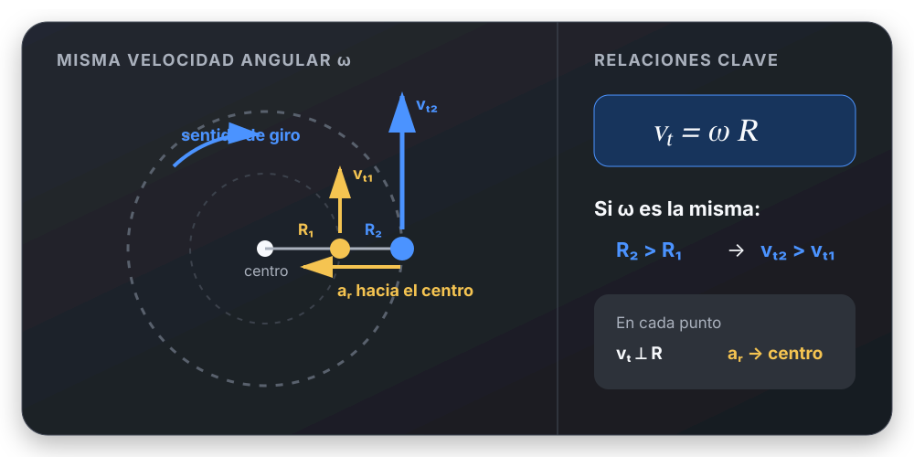
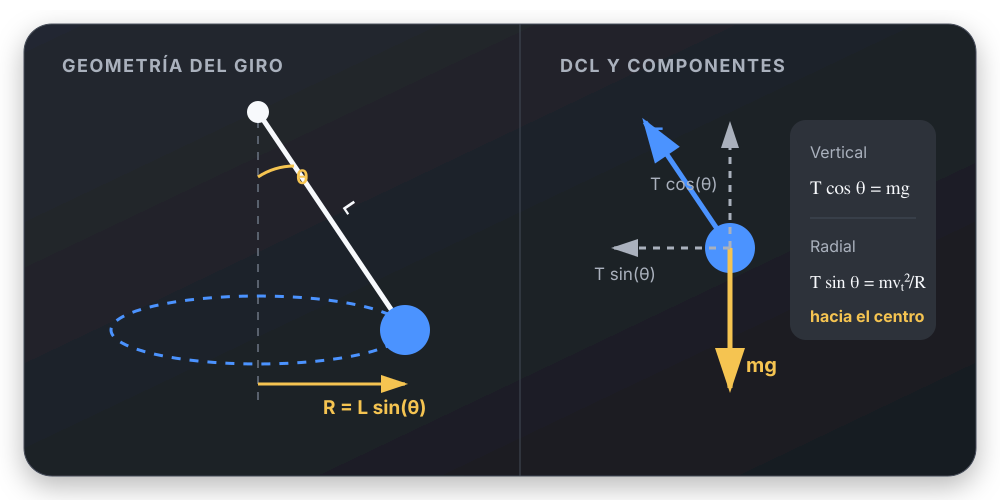
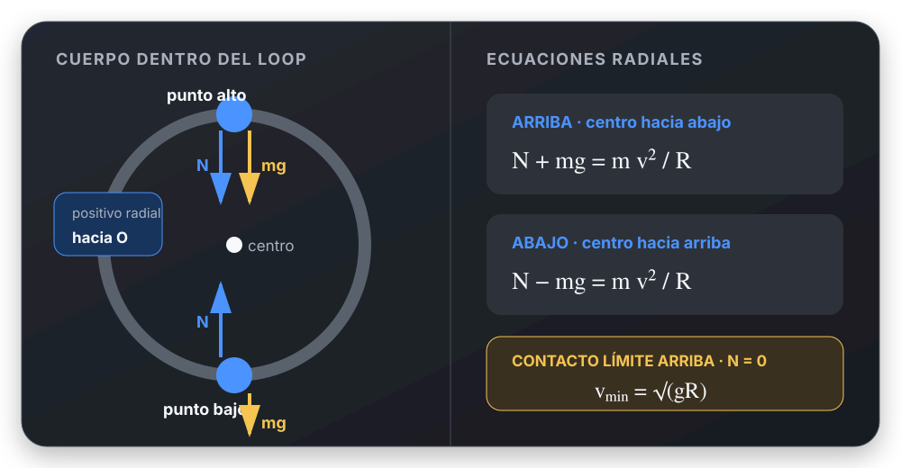

# Movimiento Circular - Cheat Sheet UTN FRLP

> Resumen de 15 minutos antes del parcial.

---

# 1. 🌀 Magnitudes angulares y lineales

## Velocidad angular

La velocidad angular indica qué tan rápido se barre un ángulo:

$$
\omega = \frac{\Delta \theta}{\Delta t}
$$

Se mide en $\text{rad/s}$. Para una vuelta, $\Delta\theta=2\pi\ \text{rad}$.

## Frecuencia y período

$$
f=\frac{1}{T},
\qquad
\omega=2\pi f=\frac{2\pi}{T}
$$

- $f$: vueltas por segundo, en $\text{Hz}$.
- $T$: tiempo de una vuelta, en $\text{s}$.

## Relación entre velocidad angular y tangencial

La velocidad angular indica qué tan rápido gira la partícula alrededor del
centro.

La velocidad tangencial es la velocidad lineal con la que la partícula recorre
la circunferencia. Su dirección es tangente a la trayectoria.

$$
v_t=\omega R
$$

donde:

- $v_t$: velocidad tangencial, en $\text{m/s}$;
- $\omega$: velocidad angular, en $\text{rad/s}$;
- $R$: radio, en $\text{m}$.

```text
Misma ω:

mayor R → mayor vₜ
menor R → menor vₜ
```



En cada punto, la velocidad tangencial es perpendicular al radio.

---

# 2. 🧭 Aceleraciones

## Aceleración angular y tangencial

$$
\alpha=\frac{\Delta\omega}{\Delta t},
\qquad
a_t=\alpha R
$$

- $\alpha$ se mide en $\text{rad/s}^2$.
- $a_t$ es tangente a la trayectoria y cambia la rapidez.
- Si $a_t$ tiene el sentido de $\vec v$, la rapidez aumenta; si se opone,
  disminuye.

## Aceleración centrípeta o radial

$$
a_r=a_c=\frac{v_t^2}{R}=\omega^2R
$$

### ¿Qué representa?

La aceleración centrípeta aparece porque el vector velocidad cambia
continuamente de dirección durante el movimiento circular.

Puede existir aunque la rapidez permanezca constante.

Siempre apunta hacia el centro de la trayectoria.

### ¿Qué cambia realmente?

En MCU:

```text
✔ rapidez → constante

✔ velocidad angular → constante

✘ dirección del vector velocidad → cambia continuamente
```

## Aceleración total

Como $\vec a_r\perp\vec a_t$:

$$
\vec a=\vec a_r+\vec a_t,
\qquad
a=\sqrt{a_r^2+a_t^2}
$$

---

# 3. ⏱️ MCU

En el Movimiento Circular Uniforme, la rapidez angular y la rapidez tangencial
son constantes:

$$
\theta=\theta_0+\omega t
$$

```text
ω = constante       α = 0
vₜ = constante      aₜ = 0
aᵣ = vₜ²/R ≠ 0
```

La **velocidad vectorial no es constante**: cambia de dirección en cada punto.

---

# 4. 📈 MCUV

En el Movimiento Circular Uniformemente Variado, $\alpha$ es constante:

$$
\omega=\omega_0+\alpha t
$$

$$
\theta=\theta_0+\omega_0t+\frac12\alpha t^2
$$

$$
\omega^2=\omega_0^2+2\alpha\Delta\theta
$$

Para $R$ constante, $a_t=\alpha R$ es constante, pero
$a_r=\omega^2R$ cambia cuando cambia $\omega$.

---

# 5. 🎯 Dinámica radial: regla de oro

## La fuerza centrípeta no es una fuerza adicional

La llamada fuerza centrípeta es la **resultante radial de las fuerzas reales**.
Si se elige positivo hacia el centro:

$$
\sum F_r=ma_r=m\frac{v_t^2}{R}
$$

La resultante radial puede estar formada por tensión, normal, rozamiento, peso
o una combinación. En el DCL se dibujan esas fuerzas reales, no una fuerza
centrípeta aparte.

```text
hacia el centro:  signo +
desde el centro:  signo −
```

En la dirección tangencial:

$$
\sum F_t=ma_t
$$

---

# 6. 🧵 Péndulo cónico

$\theta$ es el ángulo del hilo con la vertical y $R=L\sin\theta$.



Para giro uniforme:

$$
F_T\cos\theta=mg
$$

$$
F_T\sin\theta=m\frac{v_t^2}{R}
$$

Al dividir ambas ecuaciones:

$$
\tan\theta=\frac{v_t^2}{Rg}
$$

---

# 7. 🚗 Curva plana con roce

En una curva horizontal, el rozamiento estático apunta hacia el centro y
proporciona la resultante radial. Además, $N=mg$.

Para cualquier rapidez sin deslizamiento:

$$
f_s=m\frac{v_t^2}{R}
$$

Sólo en la rapidez máxima se cumple $f_s=f_{s,\max}=\mu_sN$:

$$
v_{\max}=\sqrt{\mu_sgR}
$$

---

# 8. 🛣️ Curva peraltada sin roce

Para la rapidez de diseño, si no actúa rozamiento:

$$
N\cos\beta=mg,
\qquad
N\sin\beta=m\frac{v_t^2}{R}
$$

Por lo tanto:

$$
\tan\beta=\frac{v_t^2}{Rg}
$$

$$
v_t=\sqrt{Rg\tan\beta},
\qquad
R=\frac{v_t^2}{g\tan\beta}
$$

Si hay roce, estas fórmulas solas no alcanzan: hay que incluirlo en el DCL.

---

# 9. 🎢 Movimiento circular vertical

Para un cuerpo que se mueve **por dentro** de un loop:



## Punto más bajo

El centro está arriba:

$$
N-mg=m\frac{v_{\text{abajo}}^2}{R}
$$

## Punto más alto

El centro está abajo:

$$
N+mg=m\frac{v_{\text{arriba}}^2}{R}
$$

## Condición mínima de contacto

En el caso límite, en el punto más alto $N=0$:

$$
v_{\text{arriba,min}}=\sqrt{gR}
$$

### Si el cuerpo está unido a una cuerda

En el DCL se usa la tensión $T$, no la normal $N$. En el punto más alto, con el
eje radial positivo hacia el centro:

$$
T+mg=m\frac{v^2}{R}
$$

Una cuerda puede tirar, pero no empujar: debe cumplirse $T\geq0$. Si el cálculo
da $T<0$, la cuerda se afloja y ese movimiento circular no puede mantenerse
con los datos supuestos. El caso límite es $T=0$.

Si sólo actúan fuerzas conservativas, relacionar velocidades entre alturas con:

$$
\frac12mv_A^2+mgy_A=\frac12mv_B^2+mgy_B
$$

Sin pérdidas, la rapidez mínima en el punto bajo para completar un loop es:

$$
v_{\text{abajo,min}}=\sqrt{5gR}
$$

---

# 10. 🧩 Método de resolución

1. Dibujar la trayectoria, ubicar el centro y hacer el DCL con fuerzas reales.
2. Elegir en el punto analizado un eje radial hacia el centro y otro tangente.
3. Relacionar $v_t$, $\omega$, $R$ y, si cambia la altura, usar energía.
4. Proyectar Newton: $\sum F_r=mv_t^2/R$ y $\sum F_t=ma_t$.
5. Aplicar la condición física: contacto, cuerda tensa o roce estático máximo.
6. Revisar signos, unidades, sentido y si el resultado es físicamente posible.

## Tarjeta rápida: signos en la dirección radial

```text
ANTES de escribir ΣFᵣ:

□ ¿Dónde está el centro?
□ ¿Hacia dónde apunta aᵣ?
□ ¿Ese será mi sentido radial positivo?
□ ¿Cada fuerza apunta a favor o en contra?
□ Recién ahora escribo ΣFᵣ.
```

La dirección radial cambia con la posición: no memorizar una ecuación de signos
para todo el recorrido.

---

# 11. ⚠️ Errores que hacen perder puntos

- ❌ Dibujar una fuerza centrípeta además de las fuerzas reales.
- ❌ Afirmar que en MCU la velocidad vectorial o la aceleración son nulas.
- ❌ Confundir $a_t$ (cambia la rapidez) con $a_r$ (cambia la dirección).
- ❌ Usar $f_s=\mu_sN$ cuando el rozamiento todavía no está en su valor máximo.
- ❌ Usar la fórmula de curva peraltada sin aclarar que no hay roce.
- ❌ Mantener los mismos signos radiales en distintos puntos de un loop.
- ❌ Confundir el radio de giro con la longitud de una cuerda.
- ❌ Mezclar grados con ecuaciones angulares: usar $\theta$ en radianes.
- ❌ Olvidar convertir rpm a rad/s:

$$
\omega=(\text{rpm})\frac{2\pi}{60}
$$

---

# ✅ Checklist antes de entregar

- [ ] Hice el DCL sólo con fuerzas reales.
- [ ] Marqué el centro y elegí ejes radial y tangencial.
- [ ] Escribí cada fuerza con el signo correspondiente.
- [ ] Elegí las relaciones cinemáticas o de energía necesarias.
- [ ] Apliqué Newton por componentes.
- [ ] Revisé unidades y condiciones límite.
- [ ] Respondí con módulo y dirección cuando corresponde.
