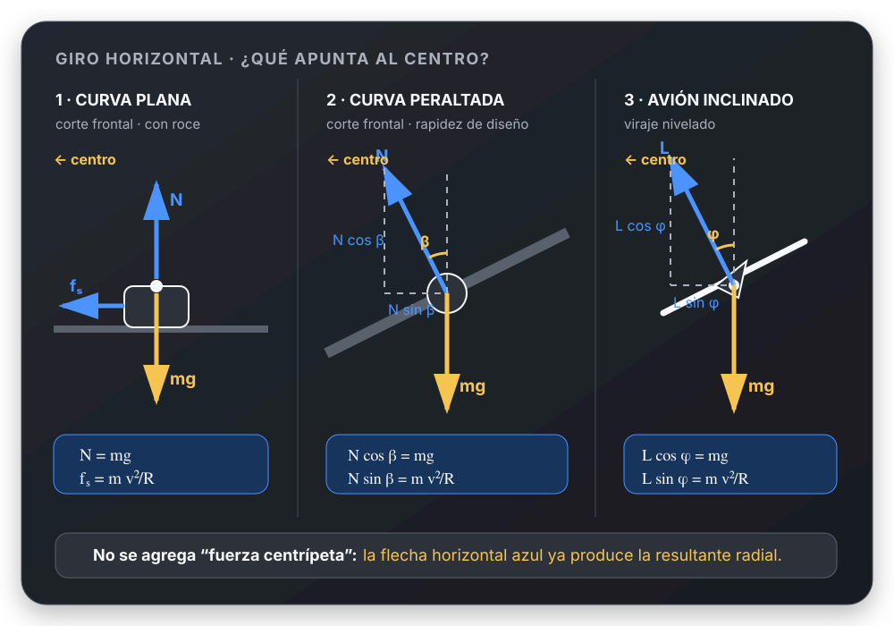
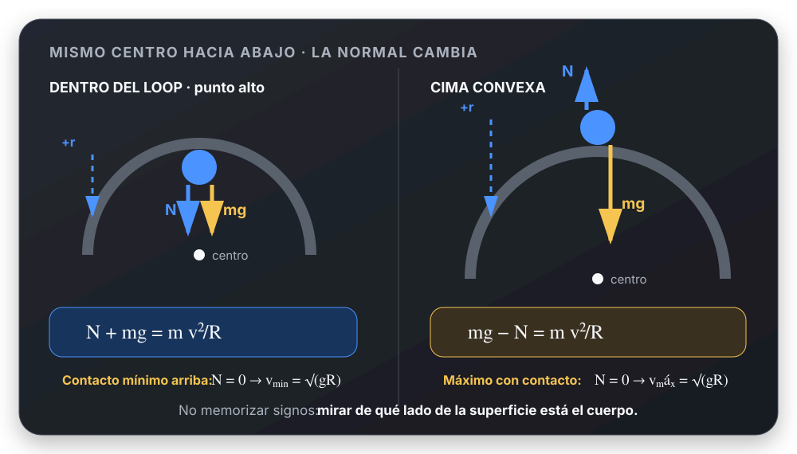

# Movimiento Circular - Machete visual UTN FRLP

> Repaso de 15 a 20 minutos. Objetivo: mirar el enunciado, reconocer el caso y
> empezar sin releer teoría.

**Ruta corta:** trayectoria y centro → dibujo → DCL → ejes radial/tangencial →
Newton → condición límite. Si cambia la altura, sumar energía.

---

# 🧠 ¿Qué tipo de problema tengo?

```text
¿La trayectoria es circular?
          │
          ├── NO → este machete no aplica
          │
          └── SÍ
               │
               ├── ¿La rapidez es constante?
               │       ├── SÍ → MCU: aₜ = 0, aᵣ ≠ 0
               │       └── NO → hay aₜ y aᵣ
               │
               ├── ¿Cambia la altura?
               │       ├── NO → giro horizontal
               │       └── SÍ → círculo vertical; puede requerir energía
               │
               ├── ¿Qué mantiene el giro?
               │       ├── cuerda → tensión
               │       ├── pista/superficie → normal
               │       ├── camino plano → rozamiento
               │       ├── superficie inclinada → componente de la normal
               │       ├── avión → componente horizontal de la sustentación
               │       └── órbita → gravedad
               │
               └── ¿Hay condición límite?
                       ├── cuerda a punto de aflojarse → T = 0
                       ├── contacto a punto de perderse → N = 0
                       └── derrape inminente → fₛ = μₛN
```

## Entrada rápida por palabras del enunciado

| Si aparece... | Caso probable | Primera idea |
| --- | --- | --- |
| rpm, vueltas, período | cinemática angular | convertir a $\omega$ |
| rapidez constante | MCU | $a_t=0$, pero $a_r\neq0$ |
| acelera o frena mientras gira | MCUV o giro no uniforme | separar $a_t$ y $a_r$ |
| cuerda inclinada y giro horizontal | péndulo cónico | $T$ sostiene y curva |
| curva plana, no derrapar | curva con roce | $f_s$ da la resultante radial |
| calzada inclinada o peralte | curva peraltada | descomponer $N$ |
| avión inclinado en viraje | giro horizontal | descomponer sustentación |
| loop, rulo, cima o punto bajo | círculo vertical | Newton local + energía entre puntos |
| mínimo para completar o no perder contacto | condición límite | imponer $T=0$ o $N=0$ donde corresponda |
| satélite u órbita circular | gravitación | la gravedad da la resultante radial |

---

# ✏️ ¿Qué dibujo hago?

Hacer **dos dibujos separados** evita casi todos los errores:

```text
1) GEOMETRÍA / CINEMÁTICA          2) DCL del cuerpo

   trayectoria                        sólo fuerzas reales
   centro O                           ejes locales: +r hacia O
   radio R                            eje t tangente
   velocidad v tangente               NO dibujar "F centrípeta"
```

## Esquemas mínimos por caso

```text
Giro horizontal, vista superior       Círculo vertical, punto elegido

            v →                                  v →
        ● cuerpo                              ● cuerpo
        │                                        │
        │ R                                      │ R
        ↓ +r                                     ↓ +r
        O centro                                 O centro

Marcá hacia O antes de asignar signos.   +r cambia con la posición.
```

```text
Curva plana, corte frontal             Peralte, corte frontal

           ↑ N                              ↖ N
           ●                                  ●
           ↓ mg                              ↓ mg
    fₛ → hacia el centro                 pista inclinada β

La vista superior muestra el giro.      N tiene componente radial.
```

Para péndulo cónico y loop usar los esquemas específicos de las secciones
correspondientes.



---

# 🧲 ¿Qué fuerza real produce la resultante radial?

La aceleración radial **no revela una fuerza nueva**. Preguntar qué fuerzas
reales tienen componente hacia el centro.

| Situación | Fuerza o componente hacia el centro | Ecuación radial típica |
| --- | --- | --- |
| masa con cuerda horizontal | tensión | $T=mv^2/R$ |
| péndulo cónico | componente horizontal de $T$ | $T\sin\theta=mv^2/R$ |
| auto en curva plana | rozamiento estático | $f_s=mv^2/R$ |
| curva peraltada sin roce | componente horizontal de $N$ | $N\sin\beta=mv^2/R$ |
| avión en viraje nivelado | componente horizontal de sustentación $L$ | $L\sin\phi=mv^2/R$ |
| cuerpo dentro de un loop | $N$, $mg$ o ambas, según el punto | $\sum F_r=mv^2/R$ |
| satélite en órbita circular | gravedad | $GMm/R^2=mv^2/R$ |

> **Regla de oro:** “centrípeta” describe a la **resultante radial**; no se
> agrega al DCL.

---

# 🧰 Selector de ecuaciones

```text
¿Qué pide o qué dato da?
│
├── vueltas, tiempo, rpm, ángulo
│      → f = 1/T ; ω = 2πf ; v = ωR
│
├── rapidez constante en una circunferencia
│      → aₜ = 0 ; aᵣ = v²/R = ω²R
│
├── cambia uniformemente ω
│      → ecuaciones de MCUV + aₜ = αR
│
├── fuerzas, tensión, normal, roce
│      → DCL + ΣFᵣ = mv²/R ; ΣFₜ = maₜ
│
├── velocidades en puntos de distinta altura
│      → energía entre puntos + Newton en el punto pedido
│
└── máximo, mínimo, "a punto de"
       → ecuación dinámica + condición límite física
```

**No mezclar pasos:** energía relaciona rapidez y altura; Newton determina
fuerzas y aceleración en un punto.

---

# 1. 🌐 Magnitudes angulares y lineales

## Velocidad angular, frecuencia y período

$$
\omega=\frac{\Delta\theta}{\Delta t},
\qquad
f=\frac1T,
\qquad
\omega=2\pi f=\frac{2\pi}{T}
$$

- $\omega$: rad/s; $f$: Hz; $T$: s.
- Una vuelta equivale a $2\pi\ \text{rad}$.
- Conversión útil: $\displaystyle \omega=(\text{rpm})\frac{2\pi}{60}$.

## Velocidad tangencial

$$
v_t=\omega R
$$

```text
Misma ω:   mayor R → mayor vₜ
En cada punto:   vₜ tangente a la trayectoria y vₜ ⟂ R
```


---

# 2. 🧭 Aceleraciones

| Componente | Dirección | Qué cambia | Fórmula |
| --- | --- | --- | --- |
| tangencial $a_t$ | tangente | módulo de $\vec v$ | $a_t=\alpha R$ |
| radial $a_r$ | hacia el centro | dirección de $\vec v$ | $a_r=v_t^2/R=\omega^2R$ |

$$
\alpha=\frac{\Delta\omega}{\Delta t},
\qquad
a=\sqrt{a_r^2+a_t^2}
$$

Como $\vec a_r\perp\vec a_t$, se combinan con Pitágoras. Si $\vec a_t$ tiene
el sentido de $\vec v$, la rapidez aumenta; si se opone, disminuye.

---

# 3. ⏱️ MCU y MCUV

| | MCU | MCUV ($\alpha$ constante) |
| --- | --- | --- |
| rapidez angular | $\omega$ constante | $\omega=\omega_0+\alpha t$ |
| posición angular | $\theta=\theta_0+\omega t$ | $\theta=\theta_0+\omega_0t+\frac12\alpha t^2$ |
| sin usar tiempo | — | $\omega^2=\omega_0^2+2\alpha\Delta\theta$ |
| tangencial | $a_t=0$ | $a_t=\alpha R$ |
| radial | $a_r=\omega^2R\neq0$ | cambia con $\omega$ |

En MCU la rapidez es constante, pero la **velocidad vectorial no**: cambia de
dirección en cada punto.

---

# 4. 🎯 Dinámica radial: receta de signos

1. Ubicar el centro.
2. Elegir $+r$ hacia el centro en el punto analizado.
3. Proyectar cada fuerza real sobre ese eje.
4. Escribir:

$$
\sum F_r=m a_r=m\frac{v_t^2}{R}
$$

5. Si hace falta estudiar el cambio de rapidez, usar además:

$$
\sum F_t=ma_t
$$

```text
ANTES de escribir ΣFᵣ:

□ ¿Dónde está el centro?
□ ¿Hacia dónde apunta +r?
□ ¿Qué fuerzas ayudan a apuntar hacia el centro?       signo +
□ ¿Qué fuerzas se oponen?                              signo −
□ Recién ahora escribir Newton.
```

La dirección radial cambia con la posición: no memorizar una única ecuación de
signos para todo el recorrido.

---

# 5. 🧵 Péndulo cónico

**Reconocé:** una masa unida a un hilo gira en un círculo horizontal.

**Dibujá:** geometría y DCL; $\theta$ es el ángulo del hilo con la vertical y
$R=L\sin\theta$.


**Planteá:** vertical sin aceleración y horizontal radial.

$$
T\cos\theta=mg,
\qquad
T\sin\theta=m\frac{v_t^2}{R}
$$

Al dividir se elimina $T$:

$$
\tan\theta=\frac{v_t^2}{Rg}
$$

**Control:** no confundir el radio $R$ con la longitud $L$ de la cuerda.

---

# 6. 🚗 Curva plana con roce

**Reconocé:** camino horizontal; el auto no debe deslizar lateralmente.

**Dibujá:** corte vertical para $N$ y $mg$; vista superior para $f_s$ hacia el
centro.

$$
N=mg,
\qquad
f_s=m\frac{v_t^2}{R}
$$

El rozamiento estático se adapta. **Sólo en el derrape inminente**:

$$
f_s=f_{s,\max}=\mu_sN
\qquad\Rightarrow\qquad
v_{\max}=\sqrt{\mu_sgR}
$$

---

# 7. 🛣️ Curva peraltada

**Reconocé:** la calzada está inclinada un ángulo $\beta$.

**Dibujá:** corte frontal; $mg$ vertical y $N$ perpendicular a la calzada.

## Sin roce: rapidez de diseño

$$
N\cos\beta=mg,
\qquad
N\sin\beta=m\frac{v_t^2}{R}
$$

$$
\tan\beta=\frac{v_t^2}{Rg},
\qquad
v_t=\sqrt{Rg\tan\beta}
$$

## Si hay roce

No usar directamente la fórmula anterior. Agregar $f_s$ paralelo a la calzada
y decidir su sentido por la **tendencia a deslizar**:

```text
v mayor que la de diseño → tiende a subir hacia afuera → fₛ baja la pendiente
v menor que la de diseño → tiende a bajar hacia adentro → fₛ sube la pendiente
límite de adherencia      → |fₛ| = μₛN
```

---

# 8. ✈️ Avión en viraje horizontal

**Reconocé:** viraje a altura constante con alas inclinadas un ángulo $\phi$.

**Dibujá:** sustentación $L$ perpendicular a las alas y peso $mg$ vertical.

$$
L\cos\phi=mg,
\qquad
L\sin\phi=m\frac{v^2}{R}
$$

$$
\tan\phi=\frac{v^2}{Rg}
$$

Es el mismo patrón matemático que el peralte sin roce, pero las fuerzas reales
son otras. Estas ecuaciones suponen viraje nivelado y rapidez constante.

---

# 9. 🛰️ Órbita circular

**Reconocé:** un cuerpo gira por acción gravitatoria alrededor de una masa $M$.

**Dibujá:** la gravedad apuntando al centro; no agregar otra fuerza radial.

$$
\frac{GMm}{R^2}=m\frac{v^2}{R}
\qquad\Rightarrow\qquad
v=\sqrt{\frac{GM}{R}}
$$

$R$ se mide desde el centro del cuerpo orbitado, no desde su superficie.

---

# 10. 🎢 Movimiento circular vertical

**Reconocé:** cambia la altura; la rapidez suele cambiar aunque la trayectoria
sea circular.

**Receta:**

```text
A entre dos alturas:  energía → obtener o relacionar velocidades
En el punto pedido:   DCL local → ΣFᵣ = mv²/R
Si dice "mínimo":     agregar N = 0 o T = 0 en el punto crítico
```

## Cuerpo por dentro de un loop


| Punto | Hacia el centro | Ecuación radial |
| --- | --- | --- |
| abajo | arriba | $N-mg=mv_{\text{abajo}}^2/R$ |
| arriba | abajo | $N+mg=mv_{\text{arriba}}^2/R$ |
| lateral | horizontal | $N=mv_{\text{lateral}}^2/R$ |

En el punto lateral, el peso es tangencial y cambia la rapidez.

### Contacto mínimo

El punto crítico para completar el loop por dentro es el más alto. En el caso
límite $N=0$:

$$
v_{\text{arriba,min}}=\sqrt{gR}
$$

## Cuerpo unido a una cuerda

Reemplazar $N$ por $T$ donde la cuerda es la que obliga a girar. Arriba:

$$
T+mg=m\frac{v^2}{R}
$$

Una cuerda puede tirar, no empujar: debe cumplirse $T\geq0$. Si el cálculo da
$T<0$, la hipótesis de cuerda tensa es imposible. El límite es $T=0$.

## Cima convexa: cuerpo sobre la pista

En la parte superior, el centro está abajo, pero la normal apunta arriba:



$$
mg-N=m\frac{v^2}{R}
$$

Al perder contacto, $N=0$ y $v=\sqrt{gR}$. No confundir esta ecuación con la
del cuerpo **dentro** de un loop.

## Energía entre alturas

Si sólo actúan fuerzas conservativas:

$$
\frac12mv_A^2+mgy_A=\frac12mv_B^2+mgy_B
$$

Sin pérdidas, para entrar desde el punto bajo y completar un loop por dentro:

$$
v_{\text{abajo,min}}=\sqrt{5gR}
$$

Esta última fórmula no es universal: combina energía con la condición
$N=0$ o $T=0$ en el punto alto.

---

# 11. 🚦 Condiciones límite: traductor inmediato

| Frase del enunciado | Igualdad del caso límite | Después verificar |
| --- | --- | --- |
| “a punto de aflojarse” | $T=0$ | para el movimiento supuesto, $T\geq0$ |
| “a punto de perder contacto” | $N=0$ | mientras hay contacto, $N\geq0$ |
| “a punto de derrapar” | $|f_s|=\mu_sN$ | antes del límite, $|f_s|<\mu_sN$ |
| “rapidez mínima para completar” | límite en el punto crítico | energía hasta ese punto |
| “rapidez máxima sin deslizar” | roce estático máximo | sentido correcto de $f_s$ |

> Una igualdad límite se impone sólo si el enunciado pide máximo, mínimo o
> inminencia. En una situación ordinaria, primero se calcula la fuerza requerida
> y luego se comprueba si es posible.

---

# 12. 🧩 Método general de resolución

1. **Reconocer:** ¿horizontal o vertical?, ¿rapidez constante?, ¿hay límite?
2. **Dibujar:** trayectoria, centro, radio y velocidad tangente.
3. **Aislar:** hacer el DCL únicamente con fuerzas reales.
4. **Elegir ejes locales:** $+r$ hacia el centro y $t$ tangente.
5. **Conectar datos:** $v=\omega R$, período/frecuencia o MCUV.
6. **Relacionar alturas:** usar energía sólo si corresponde.
7. **Aplicar Newton:** $\sum F_r=mv^2/R$ y, si hace falta,
   $\sum F_t=ma_t$.
8. **Imponer el límite:** $T=0$, $N=0$ o $|f_s|=\mu_sN$ sólo cuando corresponda.
9. **Verificar:** unidades, signos, dirección y posibilidad física.

---

# 13. ⚠️ Errores que hacen perder puntos

- ❌ Dibujar una fuerza centrípeta además de las fuerzas reales.
- ❌ Creer que “rapidez constante” significa aceleración nula.
- ❌ Dibujar $\vec v$ hacia el centro: la velocidad es tangente.
- ❌ Confundir $a_t$ —cambia rapidez— con $a_r$ —cambia dirección—.
- ❌ Usar $f_s=\mu_sN$ sin estar en el límite de deslizamiento.
- ❌ Usar la fórmula del peralte sin aclarar si hay roce.
- ❌ Mantener los mismos signos radiales en distintos puntos de un loop.
- ❌ Confundir radio de giro con longitud de cuerda o altura sobre la superficie.
- ❌ Usar conservación de energía para hallar directamente $N$, $T$ o $f_s$.
- ❌ Mezclar grados con ecuaciones angulares: en ellas, usar radianes.
- ❌ Aceptar $N<0$ o $T<0$: indican que se perdió contacto o se aflojó la cuerda.

---

# ✅ Checklist antes de entregar

- [ ] Reconocí el caso y marqué si la rapidez cambia.
- [ ] Dibujé trayectoria, centro, radio y velocidad tangente.
- [ ] Hice el DCL sólo con fuerzas reales.
- [ ] Elegí $+r$ hacia el centro en el punto analizado.
- [ ] Identifiqué qué fuerza real produce la resultante radial.
- [ ] Elegí cinemática, Newton y/o energía sin mezclar sus funciones.
- [ ] Usé una condición límite sólo si corresponde.
- [ ] Revisé unidades, signos y resultados físicamente posibles.
- [ ] Respondí con módulo y dirección cuando se pide una magnitud vectorial.
