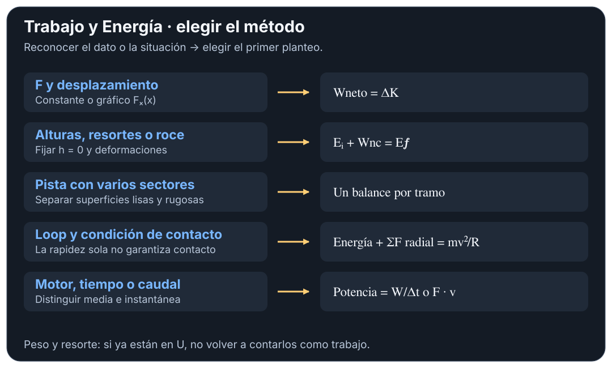
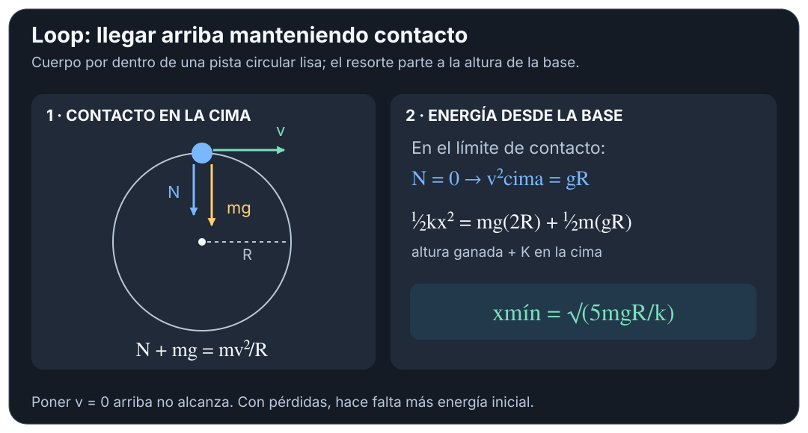

# Trabajo y Energía — resolución por casos

## 🎯 Qué recordar

**Rutina de arranque:** dibujar inicio y final → anotar $v,h,x$ → identificar
fuerzas → elegir balance → despejar → comprobar signo y unidades.

Usar $W_{\text{neto}}=\Delta K$ cuando interesan los trabajos de las fuerzas;
usar $E_i+W_{nc}=E_f$ cuando aparecen alturas o resortes. Son dos formas del
mismo balance. Los números de ejercicio corresponden al **TP 6**.

## 🖼️ Esquema / dibujo

## 📐 Fórmula

### 1. Fuerza oblicua o gráfico de fuerza — ej. 1, 3–5, 8–10

1. Dibujar cada fuerza y el desplazamiento: $W_j=F_jd\cos\theta_j$.
2. Si dan $F_x(x)$, sumar áreas **con signo** (triángulos, rectángulos o integral).
3. Obtener $v_f=\sqrt{v_i^2+2W_{\text{neto}}/m}$. Una cantidad negativa dentro
   de la raíz indica que ese estado no se alcanza con las hipótesis planteadas.

### 2. Alturas, lanzamiento o plano inclinado — ej. 6, 10–11, 20

Escribir $\frac12mv_i^2+mgh_i+W_{nc}=\frac12mv_f^2+mgh_f$.
En un plano, $\Delta h=d\sin\alpha$; la fuerza horizontal forma con el
desplazamiento el ángulo del plano. En la altura máxima de un tiro oblicuo
se anula **$v_y$**, no necesariamente toda la velocidad.

### 3. Frenado con roce — ej. 8–9, 17–18

Hacer primero el DCL para hallar $N$. En piso horizontal sin otras componentes
verticales, $N=mg$ y $\frac12mv_i^2=\mu_kmgd$ si termina detenido.
Con una fuerza que tira hacia arriba: $N=mg-F\sin\theta$, mientras haya contacto
y aceleración vertical nula. No usar esa expresión si la fuerza empuja hacia abajo.

### 4. Resorte: estirar, lanzar o comprimir — ej. 13–17, 21

Obtener $k=F/x$ si lo dan por calibración. Usar $U_e=\frac12kx^2$ en ambos
extremos. Máxima compresión: $v_f=0$; **no** significa fuerza neta cero.
Si cae desde altura $h$ sobre un resorte vertical inicialmente relajado:
$mg(h+x)=\frac12kx^2$ (sin pérdidas). Elegir la raíz física $x>0$.

### 5. Pista con distintos tramos — ej. 18–19

Marcar dónde hay roce y dónde actúa el resorte. Relacionar los extremos con
$W_r=E_f-E_i$; para hallar una velocidad intermedia, cortar el balance en ese
punto. Si el tramo rugoso es horizontal y $N=mg$: $\mu_k=-W_r/(mgd)$.

### 6. Penetración / fuerza resistente — ej. 12

Si cae desde reposo una altura $h$ y penetra $d$ hasta detenerse, el peso
trabaja durante **$h+d$**: $mg(h+d)-Rd=0$.
La resistencia media respecto del recorrido es $R=mg(h+d)/d$; sale en **N**.
Para un cuerpo que entra horizontalmente con rapidez $v$: $Rd=\frac12mv^2$.

### 7. Resorte que impulsa a un loop — ej. 22–23

Primero imponer contacto en la cima de una pista circular **por dentro**:
$N+mg=mv_{\text{cima}}^2/R$. En el mínimo de contacto, $N=0$:
$v_{\text{cima}}^2=gR$. Después, desde la base y sin roce:
$\frac12kx^2=mg(2R)+\frac12mgR$, luego $x_{\min}=\sqrt{5mgR/k}$.
Si hay pérdidas, sumarlas a la energía inicial requerida. Llegar con $v=0$
no permite mantener contacto en la cima. Revisar el vínculo si hay un riel que sujeta.

### 8. Ascensor, motor o bomba — ej. 7, 24–29

Hallar el trabajo del motor: $W_{\text{motor}}=\Delta K+\Delta U-W_r$.
Después $\mathcal P_{\text{med}}=W_{\text{motor}}/\Delta t$; si piden un instante,
$\mathcal P=\vec F_{\text{motor}}\cdot\vec v$. A rapidez constante y sin roce,
subiendo un plano: $\mathcal P=mgv\sin\alpha$.
Para una bomba ideal: $\mathcal P=\dot m[g\Delta h+(v_f^2-v_i^2)/2]$,
sin diferencia de presión entre entrada y salida. $\dot m$ es masa por segundo.

### Dos comprobaciones cortas

**TP 6, ej. 19 — altura → roce → resorte.** Bloque de 10 kg, liberado a 3 m;
resorte horizontal de $2250\ \mathrm{N/m}$, compresión $0{,}30$ m. Tomar la
base como $h=0$ y comparar dos estados de reposo:

$$
W_r=\frac12(2250)(0{,}30)^2-(10)(9{,}8)(3)
=-192{,}75\ \mathrm J.
$$

El signo negativo corresponde a disipación. **Idea:** no hace falta hallar
todas las velocidades intermedias para conocer el trabajo total del roce.

**TP 6, ej. 13 — calibrar y estirar lentamente.** Para llegar a 50 N con
$x=12$ cm: $k=50/0{,}12=416{,}7\ \mathrm{N/m}$.
El trabajo externo es el área triangular:
$W_{\text{ext}}=\frac12(50)(0{,}12)=3{,}00$ J; el del resorte es $-3{,}00$ J.
**Idea:** convertir cm a m y distinguir quién realiza el trabajo.

## ⚠️ Error frecuente

- No sumar $mgh$ y además el trabajo del peso en el mismo lado del balance.
- No extender el roce a un tramo que el enunciado declara liso.
- En el ej. 22, el umbral de contacto corresponde a una compresión **mínima**;
  el enunciado usa “máxima”. La condición física debe quedar explicitada.
- Revisar las unidades de las respuestas impresas: ver [comprobaciones](fuentes.md).

## 🔗 Ver también

- [Teoría esencial](teoria-esencial.md)
- [Movimiento Circular](../movimiento-circular/README.md)
- [Choque seguido de frenado o resorte](../impulso-cantidad-movimiento/resolucion-por-casos.md)
- [Fuentes](fuentes.md) · [Volver al tema](README.md)
