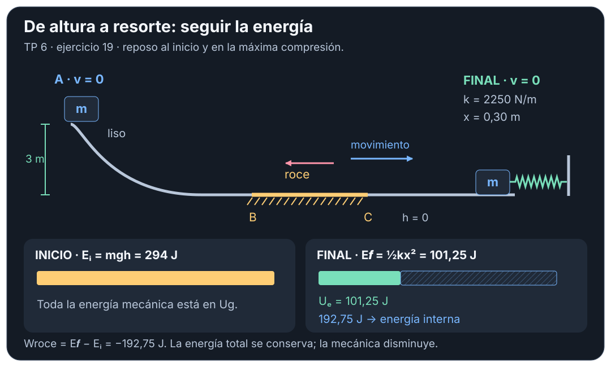
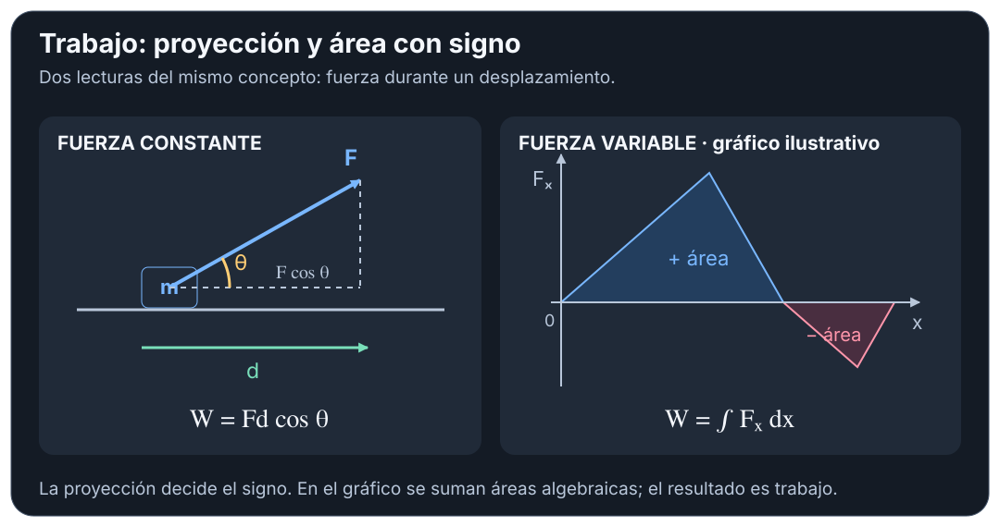

# Trabajo y Energía — teoría esencial

## 🎯 Qué recordar

- **Trabajo:** energía transferida por una fuerza durante un desplazamiento.
- **Energía cinética $K$:** asociada a la rapidez. **Potencial $U$:** a la
  configuración del sistema (altura o deformación).
- **Fuerza conservativa:** su trabajo depende de los extremos; en un recorrido
  cerrado es cero. Peso y resorte ideal tienen una energía potencial asociada.
- **Energía mecánica $E=K+U$:** se conserva si el trabajo de las fuerzas no
  incluidas mediante potenciales es cero. Con roce puede disminuir: la energía
  total se conserva, transformándose parte en energía interna.
- Sirve para relacionar **dos estados**. Para hallar tiempo, tensión o normal,
  puede hacer falta agregar cinemática o Newton.

## 🖼️ Esquema / dibujo

## 📐 Fórmula

| Necesito | Relación | Condición / significado |
| --- | --- | --- |
| Trabajo de fuerza constante | $W=Fd\cos\theta$ | $\theta$: ángulo entre fuerza y desplazamiento |
| Fuerza variable | $W=\int_i^f\vec F\cdot d\vec r$ | En 1D, área con signo bajo $F_x(x)$ |
| Cambiar la rapidez | $W_{\text{neto}}=\Delta K$, $K=\frac12mv^2$ | Modelo de partícula, masa constante, marco inercial |
| Trabajo conservativo | $W_c=-\Delta U$ | Peso: $U_g=mgh$; resorte: $U_e=\frac12kx^2$ |
| Balance mecánico | $K_i+U_i+W_{nc}=K_f+U_f$ | Incluir en $U$ todos los potenciales usados |
| Roce cinético | $W_r=-\mu_kNd$ | $N$ constante y roce opuesto al movimiento sobre una superficie fija |
| Potencia | $\mathcal P_{\text{med}}=W/\Delta t$, $\mathcal P=\vec F\cdot\vec v$ | Media en un intervalo / instantánea |

**Signos:** trabajo positivo si la fuerza favorece el desplazamiento; negativo
si se opone; cero si es perpendicular. $\Delta$ significa **final menos inicial**.

**Referencias:** elegir una sola altura cero; $x$ del resorte se mide desde su
longitud natural. No confundir $x$ con el recorrido total del bloque.

**Unidades:** masa en kg, longitud en m; $k$ en N/m; trabajo y energía en J;
potencia en W. En estos apuntes se usa $g=9{,}8\ \mathrm{m/s^2}$ salvo indicación.

## ⚠️ Error frecuente

- **Rapidez constante no significa trabajo de cada fuerza nulo:** se anula la suma.
- **Normal y tensión no tienen trabajo cero siempre:** comprobar la dirección
  del desplazamiento de su punto de aplicación.
- En una curva, $N$ puede cambiar: no usar $N=mg$ automáticamente.
- La energía da rapidez; el sentido de la velocidad se decide con el movimiento.
- En un choque inelástico no se conserva $K$: separar choque y recorrido.

## 🔗 Ver también

- [Resolución por casos](resolucion-por-casos.md)
- [Guía ampliada](guia-ampliada.md)
- [Fuentes y comprobaciones](fuentes.md)
- [Volver al tema](README.md)
